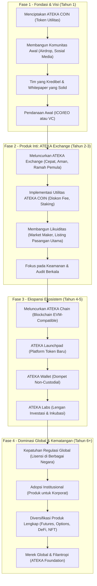

<div align="center">

# 🪙 ATEKACOIN  

  

<p>
  <a href="LICENSE">
    
  </a>
  <a href="https://ethereum.org/">
    
  </a>
  <a href="https://github.com/kongali1720/ATEKACOIN/stargazers">
    
  </a>
  <a href="https://github.com/kongali1720/ATEKACOIN/network/members">
    
  </a>
  
</p>

---

## 📖 Deskripsi
**ATEKACOIN** adalah token berbasis **Ethereum Network (ERC-20 Standard)** yang dirancang untuk **keamanan tinggi, transparansi, dan interoperabilitas lintas ekosistem DeFi**.  
Proyek ini bertujuan menghadirkan solusi pembayaran digital yang **cepat ⚡, aman 🔐, dan berorientasi pada masa depan 🌍**.  

---

## 🚀 Fitur Utama
✅ Standar **ERC-20** — kompatibel dengan seluruh ekosistem Ethereum  
✅ **Keamanan tinggi** berkat jaringan Ethereum yang telah teruji  
✅ **Transparansi penuh** dengan kontrak pintar yang dapat diaudit publik  
✅ **Integrasi mudah** ke wallet populer seperti MetaMask & Trust Wallet  

---

## 🔗 Informasi Teknis
| Atribut | Detail |
|----------|---------|
| **Standar Token** | ERC-20 |
| **Blockchain** | Ethereum |
| **Kontrak Pintar (Smart Contract)** | *(Akan diumumkan setelah audit selesai)* |
| **Total Suplai** | 500,000,000 ATEKA |
| **Simbol Token** | `ATEKA` |
| **Desimal** | 18 |

---

## 🧩 Integrasi Wallet
ATEKACOIN dapat ditambahkan secara manual di **MetaMask**, **Trust Wallet**, dan **MyEtherWallet** menggunakan alamat kontrak resmi setelah peluncuran mainnet.

---

## 🛠️ Teknologi yang Digunakan
- Solidity (Smart Contract)  
- OpenZeppelin Library  
- Hardhat / Remix IDE  
- Ethereum Mainnet / Sepolia Testnet  

---

## 🌐 Tautan Resmi
🔹 **Website:** [https://atekacoin.io](https://atekacoin.io)  
🔹 **Sticker ATEKA:** [https://kongali1720.com/ateka-sticker/index.html](https://kongali1720.com/ateka-sticker/index.html)  
🔹 **Whitepaper:** [Coming Soon](#)  
🔹 **Etherscan:** [Pending Deployment](#)  
🔹 **Twitter:** [@AtekaCoin](https://twitter.com/AtekaCoin)  
🔹 **Telegram:** [t.me/AtekaCommunity](https://t.me/AtekaCommunity)  

---

💡 *“ATEKACOIN — Membuka Gerbang Ekonomi Digital yang Aman, Terdesentralisasi, dan Transparan.”*
</div>

## 📦 Instalasi & Setup
```bash
git clone https://github.com/kongali1720/ATEKACOIN.git
cd ATEKACOIN
open index.html
```

---

# 🪙 ATEKA COIN: Perjalanan Menuju "Binance" Berikutnya

ATEKA COIN adalah proyek kripto yang berfokus pada **keberlanjutan, utilitas nyata, dan pertumbuhan ekosistem blockchain global**.  
Berikut adalah roadmap visual dan penjelasan mendalam mengenai langkah-langkah strategis menuju dominasi global seperti Binance.

---

## 📊 Diagram Perjalanan ATEKA COIN



🧩 Penjelasan Detail Setiap Fase
🚀 Fase 1: Fondasi & Visi (Tahun 1)

Tahap kritis yang menentukan arah masa depan proyek.

Menciptakan ATEKA COIN — Token utilitas dengan fungsi nyata: governance, staking, dan diskon biaya trading.

Membangun Komunitas Awal — Airdrop, AMA, dan kampanye media sosial untuk menarik pengguna pertama.

Tim yang Kredibel & Whitepaper Solid — Transparansi dan profesionalisme menjadi kunci kepercayaan.

Pendanaan Awal — Menggalang modal lewat ICO, IEO, atau VC untuk membangun infrastruktur inti.

💱 Fase 2: Produk Inti — ATEKA Exchange (Tahun 2–3)

Membangun jantung ekosistem seperti halnya Binance Exchange.

Meluncurkan ATEKA Exchange — Platform trading cepat, aman, dan ramah pemula.

Implementasi Utilitas ATEKA COIN — Diskon biaya trading dan sistem staking untuk mendorong permintaan token.

Membangun Likuiditas — Listing pasangan utama (ATEKA/BTC, ATEKA/ETH, ATEKA/USDT).

Fokus pada Keamanan — Audit berkala, cold storage, dan program bug bounty.

🌐 Fase 3: Ekspansi Ekosistem (Tahun 4–5)

Membangun ekosistem mandiri dan berkelanjutan.

ATEKA Chain — Blockchain cepat, biaya rendah, kompatibel EVM.

ATEKA Launchpad — Platform untuk meluncurkan proyek baru dengan dukungan komunitas.

ATEKA Wallet — Dompet non-custodial yang aman dan mudah digunakan.

ATEKA Labs — Inkubator dan investor untuk proyek-proyek kripto potensial.

🌍 Fase 4: Dominasi Global & Kematangan (Tahun 6+)

Menjadi pemain besar dengan kepatuhan, inovasi, dan dampak sosial.

Kepatuhan Regulasi Global — Mendapat lisensi resmi di berbagai negara.

Adopsi Institusional — Menyediakan produk premium bagi korporasi dan institusi keuangan.

Diversifikasi Produk Lengkap — Futures, Options, DeFi, NFT, dan pinjaman berbasis blockchain.

Merek Global & Filantropi — Membangun citra positif melalui ATEKA Foundation.

🔑 Faktor Kunci Sukses

Eksekusi yang Flawless — Ide bagus tanpa pelaksanaan yang baik akan gagal.

Keamanan di Atas Segalanya — Satu insiden peretasan dapat menghancurkan reputasi.

Inovasi Berkelanjutan — Dunia kripto berkembang cepat; ATEKA harus terus beradaptasi.

Komunitas di Pusat Ekosistem — Mendengar, melibatkan, dan memberi penghargaan kepada komunitas.

🌟 Visi Akhir

Menjadikan ATEKA COIN bukan hanya sebagai token, tetapi gerakan global untuk masa depan finansial yang berkelanjutan, inklusif, dan transparan.


---

## 🚀 Fitur Utama
- 🔥 Transaksi cepat dengan bia


🤝 Kontribusi
Kami membuka peluang kontribusi! Fork repositori ini, buat branch, dan ajukan Pull Request.

📜 Lisensi
Proyek ini menggunakan lisensi MIT.

---


## ✅ Gaspol coding squad Indonesia! 🚀💻

> Belajar sambil praktek langsung. Run it, understand it.  
> Mini project Python yang gak bikin ngantuk!

---

## ☕ Traktir Kopi & Nasi Padang

<p align="center">
  <strong>Dukung terus biar semangat bikin karya edukatif lainnya...</strong><br>
  💡 ☕ <a href="https://www.paypal.com/paypalme/bungtempong99" target="_blank">Buy Me a Coffee via PayPal</a>
</p>

---

## ❤️ INITIATING HUMANITY MODE... for Down Syndrome

| Target        | Anak-anak Pejuang Down Syndrome |
|---------------|-------------------------------|
| Status        | Butuh Dukungan                |
| Aksi          | Buka Hati + Klik Link = Senyum Baru |

> Mereka bukan berbeda. Mereka hadir untuk mengajarkan kita arti cinta sejati dan kesabaran.

<p align="center">
  <a href="https://mydonation4ds.github.io/" target="_blank">
    
  </a>
</p>

---

## 💳 Dukungan Pembayaran DONASI

<p align="center">
  
  &nbsp;&nbsp;
  
  &nbsp;&nbsp;
  
</p>

---

<p align="center">
  Kalau project ini bermanfaat, kasih ⭐ ya dan share ke temen-temenmu!<br>
  Follow <a href="https://twitter.com/kongali1720" target="_blank">@kongali1720</a> buat update seru lainnya 🔥
</p>

<p align="center">
  <a href="https://twitter.com/kongali1720" target="_blank">
    
  </a>
</p>


